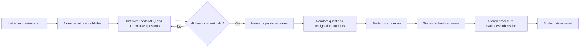

# ITI Examination System

An ASP.NET Core MVC web application for managing ITI courses, instructors, students, and online examinations. The system supports role-based account provisioning, course enrollment, exam authoring, randomized exam assignment, timed exam attempts, automatic grading, and result viewing.

## Highlights

- Role-based workflows for administrators, instructors, and students.
- ASP.NET Core Identity authentication with custom application users and roles.
- Admin user management and role-specific profile provisioning.
- Course, branch, track, instructor, and student relationships.
- Instructor exam creation with configurable duration, total points, and randomization.
- MCQ and True/False question authoring with validation.
- Exam publishing only after required question and answer validation.
- Random question assignment to eligible students with a configurable student limit.
- Student exam delivery, answer submission, automatic evaluation, and result display.
- SQL Server stored procedures and table-valued parameters for exam delivery and submission workflows.
- Entity Framework Core migrations applied automatically when the application starts.

## User Roles

### Administrator

- View the registered users and their assigned roles.
- Create students and instructors through the registration workflow.
- Assign students to branches and tracks.
- Assign instructors to branches and courses.
- Delete users after confirmation.

### Instructor

- View assigned courses and course details.
- View available exams for taught courses.
- Create unpublished exams for a course.
- Add MCQ questions with exactly four choices and one correct answer.
- Add True/False questions with a required correct answer.
- Review exam questions and question counts.
- Publish completed exams.
- Assign randomized question sets to students and limit the number of students processed.

### Student

- View the student profile and enrolled courses.
- View available assigned exams.
- Start an exam and answer MCQ or True/False questions.
- Submit answers with the time taken.
- View the resulting submission and grade.

## Exam Lifecycle



An exam must contain at least **7 MCQ questions** and **3 True/False questions** before it can be published. Each MCQ must contain exactly four choices with exactly one correct choice. Each True/False question must define a correct answer.

## Technology Stack

- **Runtime:** .NET 9
- **Web framework:** ASP.NET Core MVC
- **Authentication:** ASP.NET Core Identity
- **ORM:** Entity Framework Core 9
- **Database:** Microsoft SQL Server
- **UI:** Razor views, HTML, CSS, and JavaScript under `wwwroot`
- **Data access:** EF Core LINQ queries plus SQL Server stored procedures

## Architecture

The application follows a conventional ASP.NET Core MVC structure:

- **Controllers:** Handle HTTP requests, authorization boundaries, model validation, and view selection.
- **Services:** Contain student, instructor, exam, and user-provisioning business logic.
- **Entities:** Represent Identity records and the examination domain model.
- **View models:** Define form input and view-specific output contracts.
- **Persistence:** Contains `ApplicationDbContext`, entity configurations, stored-procedure DTOs, and EF Core migrations.
- **Views:** Razor pages grouped by account, admin, instructor, student, and shared UI.

## Domain Model

The main domain entities include:

- `Branch` and `Track` for academic organization.
- `Student` and `Instructor` for user-specific profiles.
- `Course`, `Topic`, and course relationship entities.
- `Exam`, `Question`, and `Choice` for exam authoring.
- `BranchTrack`, `CourseInstructor`, and `StudentCourse` for many-to-many relationships.
- `Submission` and `StudentAnswer` for attempts, answers, and grading results.
- ASP.NET Identity users, roles, claims, and related authentication tables.

## Prerequisites

Install the following before running the project:

- .NET 9 SDK
- SQL Server 2019 or later, SQL Server Express, or a compatible hosted SQL Server instance
- Visual Studio 2022 with the ASP.NET and web development workload, or VS Code with the C# tooling
- Optional: EF Core CLI tools for creating and managing migrations

Verify the SDK installation:

```bash
dotnet --version
```

The result should be a .NET 9 SDK version.

## Configuration

The application reads the database connection string named `DefaultConnection` from configuration.

For local development, prefer User Secrets or environment variables instead of committing credentials to `appsettings.json`:

```bash
dotnet user-secrets init
dotnet user-secrets set "ConnectionStrings:DefaultConnection" "Server=.\\SQLEXPRESS;Database=ITIExaminationSystem;Trusted_Connection=True;TrustServerCertificate=True;MultipleActiveResultSets=True"
```

Alternatively, use an untracked `appsettings.Development.json` entry:

```json
{
  "ConnectionStrings": {
    "DefaultConnection": "Server=.\\SQLEXPRESS;Database=ITIExaminationSystem;Trusted_Connection=True;TrustServerCertificate=True;MultipleActiveResultSets=True"
  }
}
```

The checked-in configuration currently contains database credentials. Those credentials should be removed from source control and rotated before deploying or sharing the repository. The development seed constants in `ExaminationSystem/Abstractions/Consts/DefaultUsers.cs` should also be treated as sensitive and changed for any real environment.

## Database Setup

1. Create an empty SQL Server database or choose a database that the configured account can create/update.
2. Confirm that the connection string points to that database.
3. Ensure the stored procedures and table-valued type required by the student and instructor workflows are available.
4. Run the application. `Program.cs` calls `Database.MigrateAsync()` during startup and applies the included EF Core migrations.

The application currently invokes these SQL Server objects:

- `GetAvailableExamsForStudent`
- `GetAllAssignedExamsForStudent`
- `SubmitStudentExamAnswers`
- `EvaluateSubmissionAndUpdateGrades`
- `FindAvilableCourseAndExams`
- `AssignRandomQuestionsToAllStudents`
- `dbo.StudentAnswerWithChoicesType` table-valued parameter type

These objects are part of the runtime database contract. Verify that they exist in the target database before testing exam assignment or student submissions.

To apply migrations manually:

```bash
dotnet ef database update --project ExaminationSystem/ExaminationSystem.csproj
```

## Run Locally

From the repository root:

```bash
dotnet restore
dotnet build
dotnet run --project ExaminationSystem/ExaminationSystem.csproj
```

The application redirects HTTP requests to HTTPS. Use the HTTPS URL printed by ASP.NET Core, commonly similar to:

```text
https://localhost:7xxx
```

The default route opens the admin area:

```text
/{controller=Admin}/{action=Index}/{id?}
```

Sign-in redirects users according to their role:

- `Admin` -> `Admin/Index`
- `InstructorRole` -> `Instructor/Index`
- `StudentRole` -> `Student/Index`

## Useful Routes

| Area       | Route                                    | Purpose                        |
| ---------- | ---------------------------------------- | ------------------------------ |
| Account    | `/Account/Login`                         | Sign in                        |
| Account    | `/Account/Logout`                        | Sign out                       |
| Account    | `/Account/Register`                      | Provision a role-specific user |
| Admin      | `/Admin`                                 | List users                     |
| Instructor | `/Instructor`                            | List assigned courses          |
| Instructor | `/Instructor/Exams`                      | View available exams           |
| Instructor | `/Instructor/UnpublishedExams`           | Manage draft exams             |
| Instructor | `/Instructor/Create?courseId={id}`       | Create an exam                 |
| Instructor | `/Instructor/CreateQuestion?examId={id}` | Add a question                 |
| Student    | `/Student`                               | View student profile           |
| Student    | `/Student/Courses`                       | View enrolled courses          |
| Student    | `/Student/Exams`                         | View available exams           |
| Student    | `/Student/StartExam`                     | Start an assigned exam         |

## Project Structure

```text
ExaminationSystem/
├── Abstractions/          Interfaces, roles, errors, and result types
├── Contracts/             Shared DTOs
├── Controllers/           MVC request handlers
├── Entities/              Domain and Identity entities
├── Errors/                Domain-specific errors
├── Persistence/           DbContext, configurations, DTOs, and migrations
├── Services/              Student, admin, instructor, and provisioning services
├── ViewModel/             Form and view models
├── Views/                 Razor views by application area
├── wwwroot/               Static CSS, JavaScript, and libraries
├── Program.cs             Application startup and middleware pipeline
├── DependancyInjection.cs Service and database registration
└── appsettings.json       Application configuration template
```

## Security Notes

- Keep connection strings, passwords, and token material outside source control.
- Rotate any credentials that have been committed to a repository or shared externally.
- Re-enable and review the commented role authorization attributes before production deployment. Several controller actions currently rely on authentication or application flow while role attributes remain commented out.
- Use HTTPS in every non-local environment.
- Configure production Identity password, lockout, cookie, and email-confirmation policies explicitly.
- Review authorization ownership checks for instructor exam operations before exposing the application publicly.
- Do not use development seed credentials in production.

## Development Notes

- Nullable reference types and implicit usings are enabled.
- EF Core configurations are discovered through `ApplyConfigurationsFromAssembly`.
- The application uses SQL Server-specific features, including stored procedures and table-valued parameters, so SQLite is not a drop-in replacement.
- There is currently no test project in the solution. Add integration coverage for authentication, exam publishing rules, assignment, submission, and grading before production use.

## Troubleshooting

### Database connection fails

Check that SQL Server is running, the configured account has access to the database, and `ConnectionStrings:DefaultConnection` is available in the active environment.

### Exam start reports no available exam

Confirm that the exam is published, students have been assigned, the required stored procedures exist, and the student is associated with the expected course or assignment data.

### Exam cannot be published

Check that the exam has at least 7 active MCQ questions and 3 active True/False questions. Every MCQ needs four choices and exactly one correct choice; every True/False question needs a correct answer.

### Submission fails

Confirm that the stored procedure `SubmitStudentExamAnswers`, the `StudentAnswerWithChoicesType` table-valued type, and `EvaluateSubmissionAndUpdateGrades` exist and match the expected parameter and column definitions.

## License

No license file is currently included. Add a license before distributing this project outside its intended academic or internal context.

